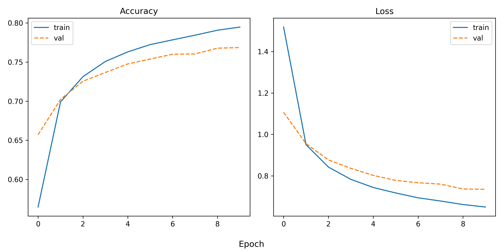

# Using pretrained CNNs for image classification
This repository holds the code for assignment 3 for visual analytics (S2023). It uses a pretrained CNN to classify images of Indo fashion.


## Description of data
The data can be found on Kaggle through this [link](https://www.kaggle.com/datasets/validmodel/indo-fashion-dataset). It consists of 106,000 images of Indo fashion in 15 cloth categories. The images are split into training, validation and test sets. The labels are stored in the metadata folder as JSON files. 

## Usage and reproducibility
1. Download the data from [here](https://www.kaggle.com/datasets/validmodel/indo-fashion-dataset) and save it in the `data` folder.
2. Create a virtual environment and install requirements
```
bash setup.sh
```
3. Activate the environment and run the classification script
```
source env/bin/activate
python src/classify_indo_fashion.py
```

## Repository overview

```
├── env
├── data                                <- not included in Github repo, remember to download data  
├── mdl
│   ├── model                           <- saved model   
│   ├── history.png
│   └── report.txt
├── src      
│   └── classify_indo_fashion.py
├── assignment_description.md
├── README.md  
├── requirements.txt
└── setup.sh                            <- Create env and install required packages     
```

## Results
The VGG16 model was finetuned to predict the classes of images of Indo fashion. The model was trained with the following parameters:
* Batch size: 512
* Epochs: 10
* Optimizer: SGD with exponential decay (decreases learning rate as training progresses)
* Initial learning rate: 0.01

For more details, see the [script](src/classify_indo_fashion.py).


The training loss keeps decreasing as the model is trained. The validation loss show the same tendency, however it decreases more slowly, especially in the later epochs. This indicates that the model might be overfitting, as the validation loss increases relative to the training loss.

The model reached an average accuracy of 78% on the test set. 
See the [report](mdl_reports/report.txt) for more details on the accuracy for each class.

